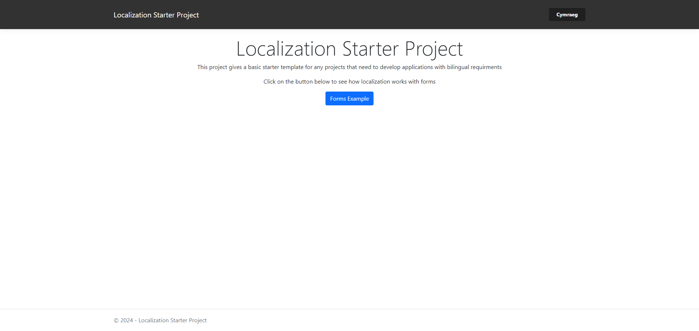
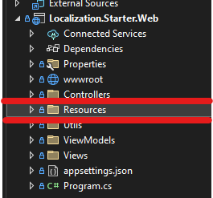
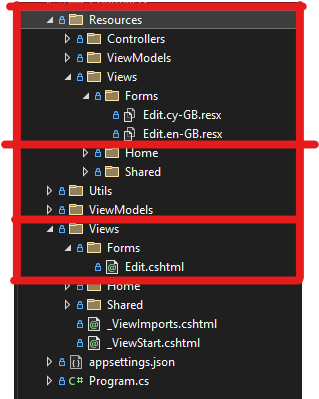
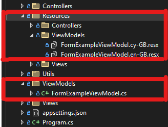

# Localization Starter Project
This is a starter code base for any project that has a bilingual requirment. Written in .NET 6 this project has localization already set up and can be taken and resused to get development work started faster.

This project has used Welsh as the second language requirement. If you have a different language requirment [See instructions below](#changing-languages)

**Steps to build the project**

1. Import the project into Visual Studio
2. Right click the solution and build
3. If built successfully run the solution
4. The solution has run correctly if you see the home page



## Localization
```c#
builder.Services.AddLocalization(opts => { opts.ResourcesPath = "Resources"; });

builder.Services
    .AddMvc()
    .AddViewLocalization(LanguageViewLocationExpanderFormat.Suffix, opts => { opts.ResourcesPath = "Resources"; })
    .AddDataAnnotationsLocalization();
```
The lines above within the program.cs file are the keys for the setup for localization.

The first tells the application that any resource file will be contained within a folder called 'Resources'.



<br/>

AddViewLocalization tells the application that resource files for Views will be contained within then same 'Resources' folder and the name of the files will start with the name of the view.



<br/>

AddDataAnnotationsLocalization allows any annotations/attributes on properties to also be translated. Any resources for those will also sit in the 'Resources' folder and with the same name as your models.



<br/>

## Changing Languages

```c#
builder.Services.Configure<RequestLocalizationOptions>(options =>
{
    var supportedCultures = new[]
    {
        new CultureInfo("en-GB"),
        new CultureInfo("cy-GB")
    };

    options.DefaultRequestCulture = new RequestCulture(culture: "en-GB", uiCulture: "en-GB");

    options.SupportedCultures = supportedCultures;

    options.SupportedUICultures = supportedCultures;
});
```

To change to the languages you can update the values in the supportCultures array. **If changing languages make sure to also update the naming of the resource files**
