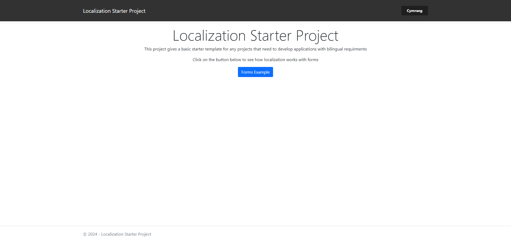
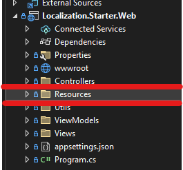
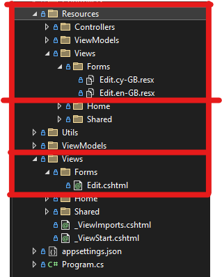
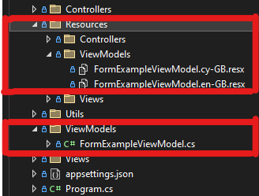

# Localization Starter Project
This is a starter code base for any project that has a bilingual requirement. This starter has localization set up and can be copied and reused to get development work started faster.

Prerequisite: Install the .NET 10 SDK. This project targets net10.0, so the .NET 10 SDK is required to build it. If using Visual Studio, use a version that supports .NET 10. Verify the SDK selected by your terminal with dotnet --version; it should report 10.x.

This project has used Welsh as the second language requirement. If you have a different language requirement [See instructions below](#changing-languages)

**Steps to build the project**

1. Open Localization.Starter.sln in Visual Studio.
2. Allow NuGet packages to restore, then select Build > Build Solution.
3. In Solution Explorer, set Localization.Starter.Web as the startup project if it is not already, then press F5 to run with debugging or Ctrl+F5 to run without debugging. The configured launch profile opens the application in a browser.
4. The application is running when the home page appears. The launch profile uses https://localhost:7084 by default.

*Unless stated otherwise, file paths are relative to the repository root. Resource file paths below are also shown relative to the repository root, including the `Localization.Starter.Web/` project folder.*



<p><sub><em>Figure 1. English home page with the option to switch to Welsh.</em></sub></p>


## Localization
```c#
builder.Services.AddLocalization(opts => { opts.ResourcesPath = "Resources"; });

builder.Services
    .AddMvc()
    .AddViewLocalization(LanguageViewLocationExpanderFormat.Suffix, opts => { opts.ResourcesPath = "Resources"; })
    .AddDataAnnotationsLocalization();
```
The lines above within the program.cs file are the keys for the setup for localization.

The first tells the application that any resource file will be contained within a folder called 'Resources'.


<p><sub><em>Figure 2. The Resources folder containing the application's localisation resource files.</em></sub></p>

<br/>

AddViewLocalization tells the application that resource files for Views will be contained within then same 'Resources' folder and the name of the files will start with the name of the view.


<p><sub><em>Figure 3. Culture-specific resource files organised by Razor view.</em></sub></p>

<br/>

AddDataAnnotationsLocalization allows any annotations/attributes on properties to also be translated. Any resources for those will also sit in the 'Resources' folder and with the same name as your models.


<p><sub><em>Figure 4. Culture-specific resource files for the form view model and its validation messages.</em></sub></p>

<br/>

## Changing Languages

This starter project supports English (en-GB) and Welsh (cy-GB).  To replace a language with another, configure its culture and provide translations for the pages and validation messages. The steps below use French (fr-FR) as an example.

1. Configure the Supported Cultures
*In this example, "fr-FR" replaces "cy-GB" in the configured cultures array.*

In Program.cs, replace "cy-GB" with "fr-FR":

```c#
builder.Services.Configure<RequestLocalizationOptions>(options =>
{
    var supportedCultures = new[]
    {
        new CultureInfo("en-GB"),
        new CultureInfo("fr-FR")
    };

    options.DefaultRequestCulture = new RequestCulture(culture: "en-GB", uiCulture: "en-GB");

    options.SupportedCultures = supportedCultures;

    options.SupportedUICultures = supportedCultures;
});
```
This 'supportedCultures' array populates both SupportedCultures for formatting and SupportedUICultures for translated text. Keep exactly two entries for bilingual implementation.

Leave DefaultRequestCulture as en-GB unless another language should become the default. The default must be one of the configured cultures.

2. Create the Resource Files
Copy the English resource files into the same directories, changing the culture suffix to `.fr-FR.resx`. These paths are relative to the repository root:

```text
Localization.Starter.Web/Resources/Controllers/FormsController.fr-FR.resx
Localization.Starter.Web/Resources/ViewModels/FormExampleViewModel.fr-FR.resx
Localization.Starter.Web/Resources/Views/Forms/Edit.fr-FR.resx
Localization.Starter.Web/Resources/Views/Home/Index.fr-FR.resx
Localization.Starter.Web/Resources/Views/Shared/_Layout.fr-FR.resx
```

Use the naming convention `<ViewOrTypeName>.<CultureCode>.resx`. Preserve the directory structure and base filename so the framework can locate the resources.

**If changing languages make sure to also update the naming of the resource files**

3. Translate the Resource Values
Translate the <value> for each resource key in the new .fr-FR.resx files. Keep each [`name`](Localization.Starter.Web/Resources/Views/Forms/Edit.en-GB.resx) key unchanged because the application uses it to look up the text. Check all five resource files, including the controller and view-model resources used for form-validation messages. Preserve any placeholders, such as {0}, in translated values.
For example, translate the value for the Submit key, but do not rename the key:

```c#
<data name="Submit" xml:space="preserve">
  <value>Envoyer</value>
</data>
```

4. Build and Verify Both Languages

Build and run the application. Check that the language switch offers French when English is selected, and English when French is selected. Review the home page, form labels and buttons in both languages. Submit the form with required fields empty to check model-validation messages, then enter an amount greater than 10,000 to check the controller-validation message. Navigate to another page after switching language to confirm the selection persists.


## Pitfalls and Limitations
Missing translations are not automatically detected, so build success does not confirm translation completeness. Manually check both languages, and locale-specific / colloquial differences that may not be noted in the resource files. For example, the layout's HTML lang attribute is currently fixed to English, and the example form uses a fixed '£' symbol.
The language switch is generated from the configured supported UI cultures, so replacing a language in the configuration does not require alteration of the selector switch.